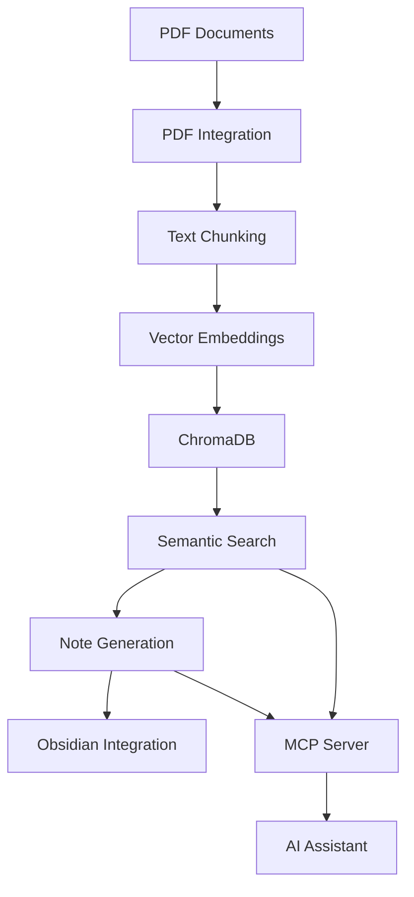

# Document Miner MCP Server

> 🧠 An intelligent MCP server that transforms your documents into a searchable knowledge base with AI-powered note generation and Obsidian integration.

[](https://python.org)
[](https://modelcontextprotocol.io)
[](LICENSE)
[](https://obsidian.md)

## 🌟 Overview

The Document Miner MCP Server is a powerful tool that automatically processes your PDF documents, creates semantic embeddings, and generates intelligent study notes. It seamlessly integrates with Obsidian and provides a robust API for knowledge retrieval and note creation.

### ✨ Key Features

- **🔍 Semantic Search**: Advanced vector-based search using sentence transformers
- **📝 AI Note Generation**: Automatically create comprehensive study notes from PDFs
- **🔗 Obsidian Integration**: Direct integration with Obsidian for seamless note management
- **📚 Multi-Format Support**: Process PDFs, textbooks, and research papers
- **🧠 Intelligent Chunking**: Advanced text chunking with LangChain for optimal context preservation
- **⚡ MCP Protocol**: Built on the Model Context Protocol for easy integration with AI assistants
- **🗄️ Vector Database**: ChromaDB integration for fast similarity search
- **🔧 Configurable**: Flexible configuration for different use cases

## 🚀 Quick Start

### Prerequisites

- Python 3.8 or higher
- Git

### Installation

1. **Clone the repository**
   ```bash
   git clone https://github.com/yourusername/knowledge-base-mcp-server.git
   cd knowledge-base-mcp-server
   ```

2. **Install dependencies**
   ```bash
   python install_deps.py
   ```
   
   Or manually:
   ```bash
   pip install -r requirements.txt
   ```

3. **Set up configuration**
   ```bash
   cp config.env.template .env
   # Edit .env with your settings
   ```

4. **Run the setup**
   ```bash
   python quick_setup.py
   ```

## 📖 Usage

### Adding Documents

1. **Place PDFs in the knowledge base directory:**
   ```
   knowledge_base/
   ├── pdfs/              # General documents
   └── textbooks/         # Academic textbooks
   ```

2. **Process documents:**
   ```python
   from integrations.pdf_integration import PDFIntegration
   from config import Config
   
   config = Config()
   pdf_integration = PDFIntegration(config)
   
   # Process a directory
   await pdf_integration.process_pdf_directory("path/to/pdfs")
   ```

### Searching Knowledge Base

```python
# Search for information
results = await pdf_integration.search_knowledge_base(
    query="machine learning algorithms",
    max_results=10
)

for result in results:
    print(f"Source: {result.source_document}")
    print(f"Content: {result.content}")
    print(f"Similarity: {result.similarity_score}")
```

### Creating Notes

```python
# Create Obsidian notes from topics
note = await pdf_integration.create_note_from_topic(
    topic="Neural Networks",
    note_type="detailed",
    focus_areas=["architecture", "training", "applications"]
)
```

## ⚙️ Configuration

The system uses a hierarchical configuration system. Key settings include:

### Environment Variables (`.env`)

```env
# Obsidian Integration
OBSIDIAN_VAULT_PATH="/path/to/your/vault"
OBSIDIAN_NOTES_FOLDER="Knowledge_Base_Notes"

# PDF Processing
PDF_DIRECTORY="knowledge_base/pdfs"
TEXTBOOK_DIRECTORY="knowledge_base/textbooks"

# Vector Database
VECTOR_DB_PATH="knowledge_base/vector_db"
SIMILARITY_THRESHOLD=0.7
MAX_SEARCH_RESULTS=10

# AI Model Settings
EMBEDDING_MODEL="all-MiniLM-L6-v2"
CHUNK_SIZE=1000
CHUNK_OVERLAP=200
```

### Advanced Configuration

See `config.py` for detailed configuration options including:
- Chunking strategies
- Embedding models
- Search parameters
- Obsidian settings

## 🔌 MCP Integration

This server implements the Model Context Protocol, making it compatible with various AI assistants:

### Available Tools

- `search_knowledge_base` - Search for information in the knowledge base
- `create_note_from_topic` - Generate notes on specific topics
- `create_note_with_content` - Create custom notes with LLM-generated content
- `get_semantic_chunks` - Retrieve raw semantic chunks
- `process_pdf_directory` - Process PDFs from a directory
- `get_study_suggestions` - Get study recommendations

### Example MCP Usage

```json
{
  "method": "tools/call",
  "params": {
    "name": "search_knowledge_base",
    "arguments": {
      "query": "data structures and algorithms",
      "max_results": 5
    }
  }
}
```

### Steps to integrate it into Cursor/Claude
```json
{
  "mcpServers": {
    "knowledge-base": {
      "command": "python",
      "args": ["<PATH_TO_PROJECT_FOLDER>/run_mcp_server.py"]
    }
  }
}
```

## 📁 Project Structure

```
doc-miner-mcp-server/
├── 📄 server.py                 # Main MCP server
├── 📄 config.py                 # Configuration management
├── 📄 run_mcp_server.py         # MCP server runner
├── 📁 integrations/
│   ├── 📄 pdf_integration.py    # PDF processing and search
│   └── 📄 obsidian_integration.py # Obsidian note creation
├── 📁 models/
│   └── 📄 knowledge_models.py   # Data models
├── 📁 knowledge_base/
│   ├── 📁 pdfs/                 # PDF documents (gitignored)
│   ├── 📁 textbooks/            # Textbook PDFs (gitignored)
│   └── 📁 vector_db/            # Vector database (gitignored)
├── 📄 requirements.txt          # Python dependencies
├── 📄 install_deps.py           # Dependency installer
├── 📄 quick_setup.py            # Quick setup script
└── 📄 config.env.template       # Configuration template
```

## 🔧 Development

### Adding New Features

1. **Create a new integration in `integrations/`**
2. **Add configuration options to `config.py`**
3. **Update the MCP server tools in `server.py`**
4. **Add tests for new functionality**

### Architecture Overview



## 🤝 Contributing

1. Fork the repository
2. Create a feature branch (`git checkout -b feature/amazing-feature`)
3. Commit your changes (`git commit -m 'Add amazing feature'`)
4. Push to the branch (`git push origin feature/amazing-feature`)
5. Open a Pull Request

### Development Setup

```bash
# Clone your fork
git clone https://github.com/yourusername/knowledge-base-mcp-server.git
cd knowledge-base-mcp-server

# Install development dependencies
pip install -r requirements.txt
python install_deps.py

# Set up pre-commit hooks (optional)
pip install pre-commit
pre-commit install
```

## 📚 Use Cases

### 🎓 Students
- Process lecture PDFs and textbooks
- Generate study notes automatically
- Create comprehensive study guides
- Build a searchable knowledge base

### 🔬 Researchers
- Process research papers and publications
- Extract key concepts and methodologies
- Create literature review notes
- Build domain-specific knowledge bases

### 📖 Knowledge Workers
- Process technical documentation
- Create training materials
- Build organizational knowledge bases
- Generate summarized reports

## 🛠️ Troubleshooting

### Common Issues

1. **Import Errors**
   ```bash
   python install_deps.py
   # or
   pip install --upgrade sentence-transformers chromadb
   ```

2. **ChromaDB Issues**
   ```bash
   # Clear the database and restart
   rm -rf knowledge_base/vector_db/
   python quick_setup.py
   ```

3. **Obsidian Integration Not Working**
   - Check `OBSIDIAN_VAULT_PATH` in `.env`
   - Ensure the vault directory exists
   - Verify folder permissions

### Getting Help
- 🐛 Report bugs in [Issues](../../issues)
- 💬 Join discussions in [Discussions](../../discussions)

## 📄 License

This project is licensed under the MIT License - see the [LICENSE](LICENSE) file for details.

## 🙏 Acknowledgments

- [Model Context Protocol](https://modelcontextprotocol.io) for the MCP specification
- [LangChain](https://langchain.com) for text processing capabilities
- [ChromaDB](https://chromadb.com) for vector database functionality
- [Sentence Transformers](https://sentence-transformers.net) for embeddings
- [Obsidian](https://obsidian.md) for the amazing note-taking platform

## 🌟 Star History

If you find this project useful, please consider giving it a star! ⭐

